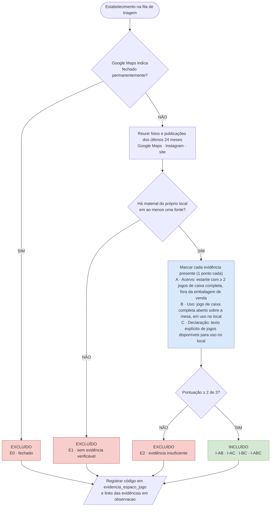

# Fluxograma de limpeza dos estabelecimentos (Bloco A)

Versão editável: `fluxograma_limpeza_bloco_a.drawio` (abrir no draw.io / diagrams.net).

## Regras de leitura

- Uma foto só conta se for do próprio estabelecimento, não imagem de divulgação.
- A sozinho não basta: a estante pode ser só de venda.
- B sozinho não basta: o jogo pode ter sido trazido pelo cliente.
- C sozinho não basta: declaração sem prova visual.
- Caso ambíguo: marcar a evidência como ausente e anotar a dúvida em `observacao`.
